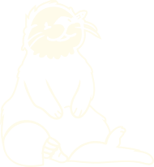

<picture align="center" width="360">
    <source media="(prefers-color-scheme: dark)" srcset="logo/otter.svg">
    <source media="(prefers-color-scheme: light)" srcset="logo/otter.svg">
    
</picture>

<h3 align="center">OG Studio</h3>

A design studio where we float easy, but design bold.

We're on a mission to make design, marketing & illustration more accesible for our partners.

[Join our community](https://example.com)

 